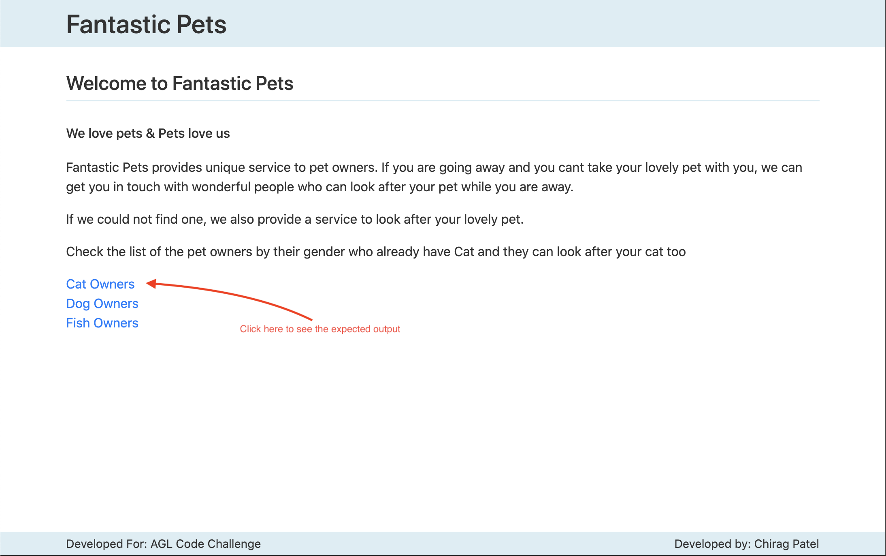

# Fantastic Pets

This project was designed with Angular CLI and try to follow best angular practices.  
With the subject provided, it was not possible to include all the best practices for the Angular. For demonstration purpose, I have little over-engineered the project.

When project loads, there is a home page where provded some information about this application.

## Home Page



## Code Challenge Output Page

This page is at route **`/pets/cat`**

## 

## Angular Best practices demonstrated

### Separation of concern

- Creating separate area for different feature for the project
- Lazy loading of feature module
- Pipe to filter data in HTML
- Service to load data from remote API server

### Modularising

- Grouping different entities under module e.g. `CoreModule` for core components UI components and services for the appliation & `SharedModule` from shared componets e.g. pipes

### Customisation of Route Component

- Customisation of Route Component using parameterised path
- Added **:petType** to route to PetComponent and you can load filtered data based on parameter passed to route

### Use Observable with Async pipe in HTML

- Used **Observable<Pet[]>** in to PetsComponent to assign value to PetList component.

> **Note:** Benifit of using Observable with Async pipe directly in HTML, is it automatically unsubscribe to observable after data retrived.

### Separation of Container component from presentational component

- PetsComponent is a container component which consume service and load data from state (in case of ngrx) or remote server

- PetListComponent is a presentational component which accept values as input and present it to html output

### Resuability

- Built a pet list component to list the pets by owner gender
- Built pipe to filter data provided to petlist component
- Built service to load data from API

### Performance

- Used **OnPush** change detection strategy for PetListComponent because is it presentational component and dont want it to render when value of change somewhere else in appliction which is not directly associated with **PetListComponent** component

### Optimistaion

- Here for the demonstration purpose, optimised the **PeopeService**. It should not call the API to fetch data again if data is already available. Also did the unit test to check that.

> Note: We can also implement force reload, reload after certail time elapsed or operation reload (if we provide CRUD operation from app, we can force reload if CRUD happen from the apps).

### Testing

- Wrote unit test for most of the components. We can write the extensive test cases for this app. Here I try to write most obvision test cases but it can be extended.
- Wrote unit test for routed parameters where fake ActivatedRoute
- Unit testing
- e2e testing

  <br>
  <br>

# How to...

## Prerequisite

Need to have machine with latest node version install, this code was developed and tested on node v14.3.0 and npm v6.14.5

```bash
# Check your node version
node -v

# Check npm installed
npm -v

# Install angular/cli globally
npm install @angular/cli -g
```

## Downloading and setting up project in your machine

```bash
# clone git repo
git clone https://github.com/microchip78/agl-code-challenge.git

# change directory
cd agl-code-challenge

# install dependencies
npm install
```

## Run Application

```bash
ng serve
```

This command will start dev server at port 4200. So open http://localhost:4200 in your location machine

## Build Application

```bash
# dev build
ng build

# build for production
ng build --prod
```

## Testing application

### Run unit test

```bash
ng test
```


<br><br>

### Run end to end test

```bash
ng e2e
```

Sample end-to-end test results


---
